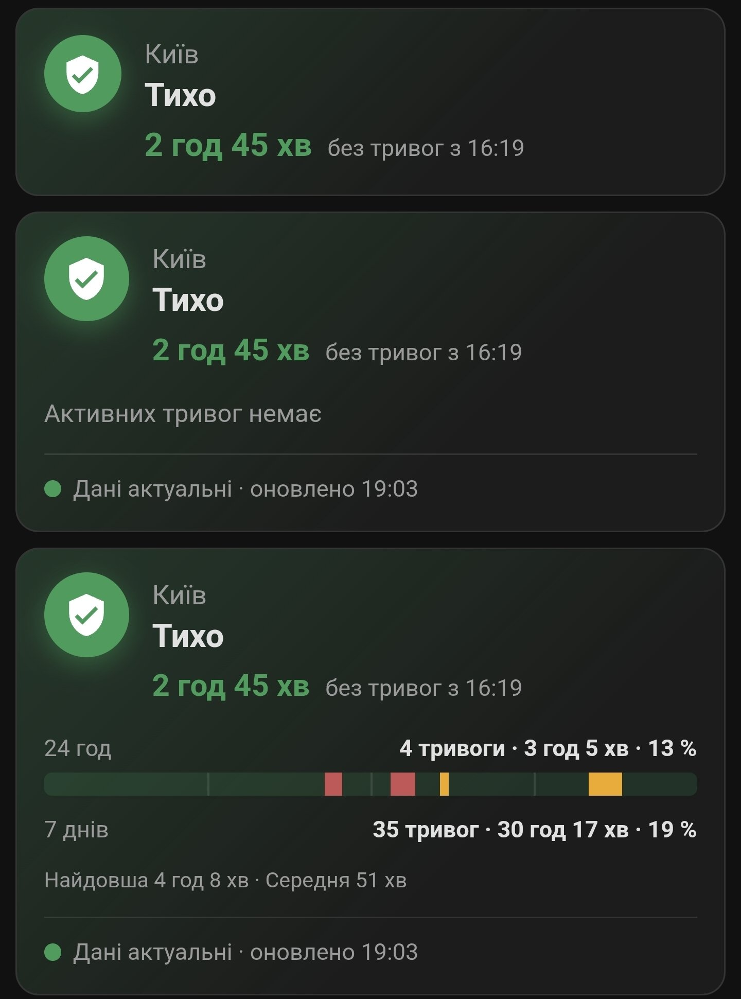

# Ukraine Alarm Pro

[](https://github.com/custom-components/hacs)


[](https://sonarcloud.io/summary/new_code?id=ABovsh_ukraine-alarm-pro)
[](https://sonarcloud.io/component_measures?id=ABovsh_ukraine-alarm-pro&metric=coverage)

🇺🇦 [Українська](README.md) · **English**

Air-raid alerts for Home Assistant. The data comes from the official
[alert map](https://map.ukrainealarm.com/) over a WebSocket — as soon as it is published,
without an API key.

## How it differs from `ukraine_alarm`

[`ukraine_alarm`](https://www.home-assistant.io/integrations/ukraine_alarm/) ships with
Home Assistant and gets its data from the same source through siren.pp.ua.
This comparison was checked against [Home Assistant 2026.9.2 source](https://github.com/home-assistant/core/tree/2026.9.2/homeassistant/components/ukraine_alarm)
and the `dev` branch as of 2026-09-15. What this integration has:

- **Alerts from every administrative level.** For an oblast, raion or hromada it takes
  the region itself, the regions above it and the regions inside it into account, and
  shows whether an alert covers the whole region or only part of it. `ukraine_alarm`
  shows the API response for one selected region.
- **A dashboard card is part of the integration.** State, alert duration or time since
  the all clear, and statistics for 24 hours and 7 days, in three layouts.
  `ukraine_alarm` has no card.
- **A 90-day alert journal.** For each region it keeps start, all clear, threat types and
  the highest level, filled with the official history right after installation; the `get_history` and `get_summary` actions return the list of
  alerts and totals for a day or a week. `ukraine_alarm` has no journal.
- **Change events and ready-made notifications.** `event.uap_<id>_event` reports an alert
  start, a level rise, a new threat, the all clear, stale data and a restored connection;
  an automation blueprint turns these events into ready messages in Ukrainian or English.
  `ukraine_alarm` creates state binary sensors only.
- **Air alert level with its reason.** A separate sensor shows the yellow or red level and
  the reason supplied by the source. In the `ukraine_alarm` `dev` branch the levels were
  added as two binary sensors, without reasons.
- **Keeps its state through a lost connection and a restart.** The last received state
  stays, and after 15 minutes without data `binary_sensor.uap_data_stale` marks it as
  stale; after a restart the integration restores the saved alert map if it is no more than
  six hours old. In
  `ukraine_alarm` a failed poll makes the entities `unavailable`.
- **One WebSocket connection for all regions**, with no limit on their number.
  `ukraine_alarm` polls the proxy every 10 seconds separately for each region and allows
  up to five regions.

After repeated WebSocket failures, the integration switches to polling siren.pp.ua
with a 60-second pause between requests. It periodically retries the WebSocket and
switches back after receiving data. The data channel and the time of the last data
received are visible in the diagnostic entities. An issue appears under Repairs only when
neither the WebSocket nor the fallback source has delivered data for 15 minutes.

## Entities

| Entity | Type | Description |
| --- | --- | --- |
| `binary_sensor.uap_<id>_alert` | safety | on while any alert is active in the region |
| `sensor.uap_<id>_threat` | enum | highest active threat: `none`, `air`, `artillery`, `urban_fights`, `chemical`, `nuclear`, `unrecognized` |
| `sensor.uap_<id>_air_alert_level` | enum | air alert level: `none`, `yellow`, `red`, `unrecognized` |
| `sensor.uap_<id>_alert_started` | timestamp | when the oldest active alert was declared; `unknown` while the region is quiet |
| `event.uap_<id>_event` | event | alert changes in the region: one event per accepted change |
| `sensor.uap_transport` | diagnostic | `websocket` or `polling` |
| `sensor.uap_last_update` | diagnostic | time of the last data received |
| `sensor.uap_active_regions` | diagnostic | how many regions are in alert country-wide |
| `binary_sensor.uap_data_stale` | diagnostic | on when no data has arrived for 15 minutes |

`sensor.uap_<id>_threat` carries an `active_alerts` attribute — the active alerts with the
name of the region that declared each one (at most 25 entries, the full number is in
`active_alert_count`). The complete list is in the diagnostics.

The `coverage` attribute tells whether the alert covers the whole region:

- `whole` — the region itself or a higher-level region containing it declared the alert;
- `partial` — alerts are declared only in part of the region, such as one raion of an
  oblast;
- `unrecognized` — an alert exists, but its region is not among the stored higher and
  lower levels;
- `none` — no active alerts.

If `whole` and `partial` apply together, the attribute shows `whole`. `coverage_by_type`
gives the coverage of each threat type. `affected_regions` lists up to 25 regions that
declared active alerts; `affected_region_count` is the full number of such regions. It
is not the number of hromadas in alert or a share of the area. Coverage does not change
`binary_sensor.uap_<id>_alert`: a partial alert is still an alert.

The air alert level covers the same region and its ancestors and descendants.
If yellow and red are active together, the sensor reports `red`; `active_levels`
contains both. `unrecognized` means an air alert exists but the source supplied no
recognized level. `none` means no air alert; other threat types remain on `threat`.

The `reasons` attribute contains up to 25 source reasons, each limited to 256 characters;
`reason_count` is the full count of distinct nonempty reasons. An empty reason does
not imply a weapon type. Full reasons and each level's declaration time are available
in diagnostics. The sensor has no long-term statistics: history is written only when
its state or attributes change. Repeated publications and changes in unrelated regions
produce no additional history rows for this sensor.

### Alert events

`event.uap_<id>_event` has these event types:

- `started` — an alert started in the region;
- `escalated` — the air alert level rose to yellow or red;
- `threat_added` — a new threat type joined an active alert;
- `updated` — any other change: a lower level, different reasons or coverage, or one of
  several types ended;
- `cleared` — the alert ended while data arrived without a gap;
- `data_stale` — the data went stale; the last known state is kept;
- `resynced` — the first data after startup or after a gap.

One change produces one event. If a type is added and the level rises together, one
`escalated` event arrives with the new type in `added_types`. After startup or a gap
the integration does not know what happened meanwhile, so it sends `resynced` with the
current state instead of `started` or `cleared`.

Event attributes: `schema_version`, `transition_id`, `region_id`, `region_name`,
`event_type`, `observed_at` (when the integration accepted the change, not an official
time), `origin` (`live`, `recovery` or `bootstrap`), `previous` and `current` (`active`,
`threat_types`, `air_level`, `reasons`, `coverage`, `declared_started_at`),
`added_types`, `removed_types`, `had_gap`, plus `observed_active_since` and
`active_since_known` — when the integration first saw the current alert and whether that
was its real start.

## Installation

HACS → custom repository → `ABovsh/ukraine-alarm-pro` → install → add the integration →
pick the regions. The whole tree is available, down to hromadas.

To change the regions later: **Settings → Devices & services → Ukraine Alarm Pro →
Configure**. Entities of removed regions are deleted automatically.

The integration keeps a copy of the region list and refreshes it once a day. If the
proxy is unavailable, the options show the saved copy with its date. A selected region
missing from the current list stays selected with a ⚠ mark and is not removed. A first
installation without network and without a saved copy is not possible: the form offers
a retry.

## Dashboard card

The card is part of the integration; there is nothing else to install. The screenshot
shows its three layouts, top to bottom:



- **Compact** — region name, state and time: how long the alert has lasted or how long
  since the all clear. During an alert the level is shown next to the name.
- **Status only** — the same, plus threat types, level, reason, coverage (the whole
  region or part of it) and whether the data is current. When data is stale the card
  says "No fresh data", not "All quiet".
- **Full** — the same, plus statistics: alert count, duration and share of time under
  alert for 24 hours and 7 days, a day strip with the alerts, and the longest and average
  alert.

Tapping the card opens the alert sensor with its history.

### Adding the card

1. Install the integration (see "Installation") and restart Home Assistant.
2. Reload the browser page. In the Home Assistant app: **Settings → Companion app →
   Troubleshooting → Reset frontend cache**, then restart the app.
3. Open a dashboard and press the pencil, **Edit dashboard**.
4. Press **Add card**, search for **Ukraine Alarm Pro** and pick the card.
5. In **Region / Регіон** pick your region's alert sensor. With a single region the card
   picks it on its own.
6. In **Layout / Вигляд** choose full, status only or compact. Optionally set
   **Name / Назва** (for example "Home") and **Language / Мова**.
7. Press **Save**. Add one card per region.

If you see "Custom element doesn't exist" or "Configuration error" instead of the card,
the browser still has the old page: repeat step 2. For YAML-mode dashboards add the
resource yourself: `/ukraine_alarm_pro/ukraine-alarm-pro-card.js`, type `module`.

### YAML configuration

```yaml
type: custom:ukraine-alarm-pro-card
entity: binary_sensor.uap_31_alert  # optional with a single region
name: Home                          # optional
layout: full                        # full, status (status only) or compact
language: auto                      # auto (Home Assistant language), uk or en
```

Statistics come from the alert journal (see "Alert history"). A few minutes after
installation the journal is filled with 90 days of official history.
The card creates no entities and no database rows. Entities may be renamed: the card finds
them by region.

## Notifications

### Notifications from events

The [event notification blueprint](https://my.home-assistant.io/redirect/blueprint_import/?blueprint_url=https%3A%2F%2Fgithub.com%2FABovsh%2Fukraine-alarm-pro%2Fblob%2Fmain%2Fblueprints%2Fautomation%2Fukraine_alarm_pro%2Falert_notify_events.yaml) reads one `event.uap_<id>_event` entity and
sends ready-made messages in Ukrainian or English, for example
"м. Київ: air raid alert since 14:32. Level: red. Reason: …" or
"м. Київ: all clear. Observed duration: 1 h 12 min."

Separate actions cover the start, a raised level or a new threat, the all clear, stale
data and restored data; an empty action sends nothing. The first data after a Home
Assistant start is silent by default. If an alert ended during a data gap, a
connection-restored message is sent, not an all clear. Actions can use `message`,
`event_type`, `origin`, `region`, `threat_types`, `added_types`, `level`, `reason` and
`payload`.

To check the actions without an alert, import the [test script](https://my.home-assistant.io/redirect/blueprint_import/?blueprint_url=https%3A%2F%2Fgithub.com%2FABovsh%2Fukraine-alarm-pro%2Fblob%2Fmain%2Fblueprints%2Fscript%2Fukraine_alarm_pro%2Ftest_notification.yaml). It sends a
message marked "TEST" and changes no alert entity, event or history.

### Earlier sensor-based blueprint

Use notifications from events for new automations. The [sensor-based blueprint](https://my.home-assistant.io/redirect/blueprint_import/?blueprint_url=https%3A%2F%2Fgithub.com%2FABovsh%2Fukraine-alarm-pro%2Fblob%2Fmain%2Fblueprints%2Fautomation%2Fukraine_alarm_pro%2Falert_notify.yaml)
stays for existing automations: an action for the start of an alert, one for the
all clear and an optional yellow-to-red action. It does not fire when Home Assistant
restarts during an alert, and sends nothing while the data is stale.

If you write a sensor-based automation by hand, add the same condition:

```yaml
condition:
  - condition: state
    entity_id: binary_sensor.uap_data_stale
    state: "off"
```

Imported blueprints are updated separately: HACS installs only the integration.

## Alert history

The integration keeps a journal of alert episodes for each region. An episode is one
continuous period while `binary_sensor.uap_<id>_alert` is on: two overlapping alerts
form one episode from the first start to the last clear.

Read it with actions that return a response:

```yaml
action: ukraine_alarm_pro.get_history
data:
  region_id: "31"
  limit: 20
response_variable: history
```

`get_history` returns up to 100 episodes, newest first, including the current one.
`get_summary` with `days: 1` (today) or `days: 7` returns the episode count,
`observed_duration_seconds`, `longest_duration_seconds`, `has_gaps` and `daily` — count and
duration per day — over Home Assistant's local days.

`observed_started_at` and `observed_cleared_at` are when the integration received the
data; `declared_started_at` is the declaration time from the source. If data was
interrupted or an alert was already active at startup, `had_gap` is `true` and
`source_start_known` is `false`.

Five minutes after startup and then once a day, the integration adds the official alert
history from the map to the journal: 90 days on the first run, the last few days after
that. This also fills the periods when Home Assistant was off. Such episodes have
`start_origin: history`, the official start and all-clear times and the type `air`: the
history has no levels. It holds alerts of oblasts, raions and cities; alerts declared
for a single hromada are not in it. Episodes the integration received itself are never
replaced. `coverage_start` shows the date the journal has data from.

Completed episodes are kept for up to 90 days and at most 1000 in total; current
episodes are never removed. Recorder history is not affected.

## What to know about the data

- `sensor.uap_active_regions` never reaches zero: the occupied territories carry
  permanently active alerts in the source, going back to 2022.
- For the same reason `sensor.uap_<id>_alert_started` shows an old date for an oblast that
  contains such a region. Pick your own raion or hromada.
- An alert type the integration does not know is reported as `unrecognized` and logged once.

## Diagnostics

**Settings → Devices & services → Ukraine Alarm Pro → Diagnostics** — the data channel, the
age of the last data, the selected regions and every active alert. There is nothing to
redact: the integration is fully anonymous.

## Data sources

[ukrainealarm.com](https://map.ukrainealarm.com/) — primary, push.
[siren.pp.ua](https://siren.pp.ua/) — volunteer proxy, fallback.
Alert history for the journal — from the [alert map](https://map.ukrainealarm.com/).
