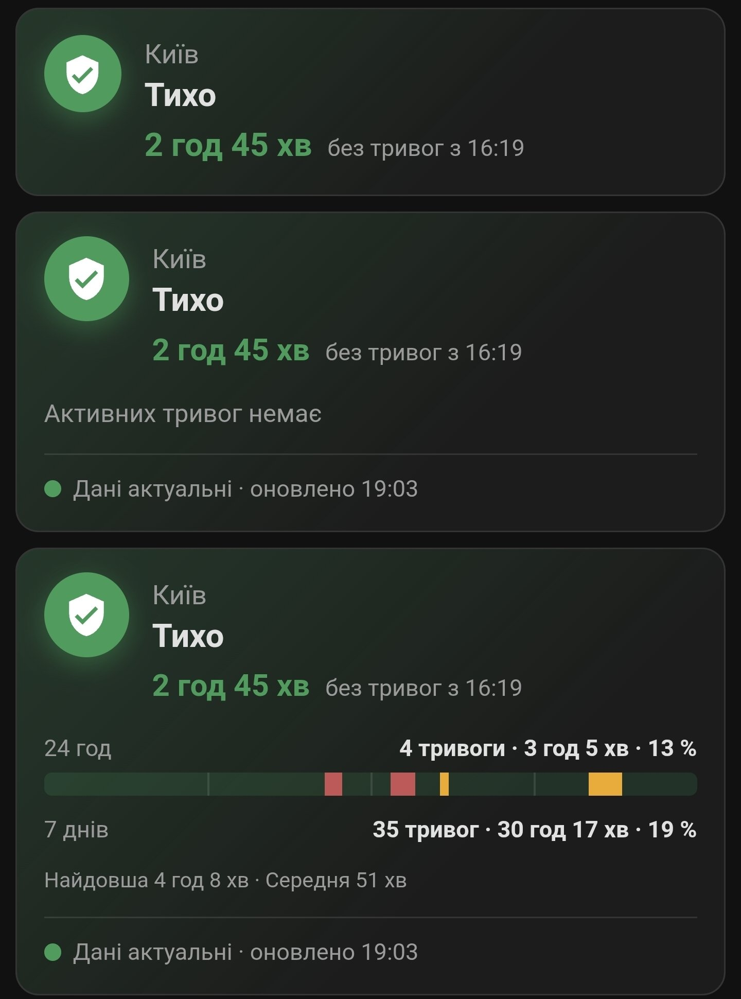

# Ukraine Alarm Pro

[](https://github.com/custom-components/hacs)


[](https://github.com/ABovsh/ukraine-alarm-pro/releases)

[](https://sonarcloud.io/summary/new_code?id=ABovsh_ukraine-alarm-pro)

🇺🇦 **Українська** · [English](README.en.md)

Повітряні тривоги для Home Assistant з офіційної [мапи тривог](https://map.ukrainealarm.com/).
Інтеграція отримує оновлення через WebSocket без API-ключа; для свіжих даних потрібен інтернет.

[Встановлення](#встановлення) · [Картка](#картка-для-панелі) · [Сповіщення](#сповіщення) ·
[Сутності](#сутності) · [Допомога](#допомога) · [Оновлення](#оновлення) · [Зміни](CHANGELOG.md)

<a id="чим-відрізняється-від-ukraine_alarm"></a>

## Можливості

- **Тривоги на рівні області, району чи громади.** Обраний регіон враховує тривоги
  адміністративних рівнів над ним і регіонів у своєму складі. Охоплення показує,
  чи тривога стосується всього регіону або лише його частини.
- **Картка для панелі.** Поточний стан, тривалість тривоги або час від відбою,
  статистика за 24 години та 7 днів; три варіанти вигляду.
- **Журнал до 90 днів.** Власні спостереження доповнюються офіційною історією
  повітряних тривог. Вона не містить рівнів і тривог, оголошених окремо для громади.
- **Події й готові шаблони сповіщень.** Початок, підвищення рівня, нова загроза,
  відбій і перерви в даних; повідомлення українською або англійською.
- **Рівень і причина повітряної тривоги.** Жовтий або червоний рівень і причина,
  якщо джерело їх передало; інші типи загроз доступні окремо.
- **Збережений стан при втраті зв'язку.** Остання карта тривог відновлюється після
  перезапуску, а окремий сенсор і картка позначають застарілі дані.
- **Спільне з'єднання для обраних регіонів.** Інтеграція не обмежує їх кількість
  і автоматично переходить на резервне джерело при повторних збоях WebSocket.

## Встановлення

Потрібні **Home Assistant 2025.1 або новіший**, інтернет і налаштований **HACS**.

1. У HACS відкрийте меню **⋮ → Custom repositories**, додайте
   `https://github.com/ABovsh/ukraine-alarm-pro` з типом **Integration**
   ([інструкція HACS](https://www.hacs.xyz/docs/faq/custom_repositories/)).
2. Знайдіть **Ukraine Alarm Pro** у HACS, завантажте інтеграцію й перезапустіть Home Assistant.
3. Відкрийте **Налаштування → Пристрої та сервіси → Додати інтеграцію** та знайдіть
   **Ukraine Alarm Pro**.
4. У полі **Регіони для стеження** оберіть принаймні один регіон і збережіть.
   Доступне все дерево, аж до громад.
5. Додайте [картку для панелі](#як-додати-картку). Дочекайтеся свіжих даних:
   `binary_sensor.uap_data_stale` має бути `off`. Після цього налаштуйте
   [сповіщення з подій](#сповіщення-з-подій), якщо вони потрібні.

### Змінити регіони

**Налаштування → Пристрої та сервіси → Ukraine Alarm Pro → Налаштувати**.
Сутності вилучених регіонів видаляються автоматично — перевірте автоматизації та картки,
які їх використовують.

Перелік регіонів зберігається локально й оновлюється раз на добу. Якщо проксі
недоступний, форма використовує збережену копію з датою. Обраний регіон, якого немає
в поточному переліку, залишається у виборі з позначкою ⚠. Для першого налаштування
без збереженої копії потрібне доступне джерело переліку.

## Картка для панелі

Картка є частиною інтеграції, окремо встановлювати її не треба. На знімку — три
варіанти вигляду, згори донизу:



- **Компактний** — назва регіону, стан і час: скільки триває тривога або скільки минуло
  від відбою. Під час тривоги поруч із назвою видно рівень.
- **Лише стан** — те саме, а також типи загроз, рівень, причина, охоплення (увесь регіон
  чи його частина) і чи актуальні дані. Коли дані застаріли, картка пише «Немає свіжих
  даних», а не «Тихо».
- **Повний** — те саме, а також статистика за 24 години та 7 днів: кількість тривог, їх
  тривалість, частка часу під тривогою, смуга доби з тривогами, найдовша й середня
  тривога.

Натискання на картку відкриває сенсор тривоги з його історією. Клавіша Tab
переводить фокус на картку, Enter або пробіл відкривають той самий сенсор.

### Як додати картку

1. Після встановлення інтеграції оновіть сторінку Home Assistant у браузері або застосунку.
2. На панелі натисніть **Редагувати панель → Додати картку**, знайдіть **Ukraine Alarm Pro**.
3. У полі **Region / Регіон** оберіть сенсор тривоги свого регіону.
   Якщо регіон один, картка обирає його сама.
4. У полі **Layout / Вигляд** оберіть вигляд. За потреби задайте **Name / Назва**
   (наприклад, «Дім») і **Language / Мова**.
5. Натисніть **Зберегти**. Для кожного регіону додайте окрему картку.

Для панелей у режимі YAML додайте ресурс вручну:
`/ukraine_alarm_pro/ukraine-alarm-pro-card.js`, тип `module`.
Якщо картка не з'явилася, див. [допомогу](#допомога).

### Картка в YAML

```yaml
type: custom:ukraine-alarm-pro-card
entity: binary_sensor.uap_31_alert  # необов'язково, якщо регіон один
name: Дім                           # необов'язково
layout: full                        # full — повний, status — лише стан, compact — компактний
language: uk                        # auto (як у Home Assistant), uk або en
```

Статистику картка бере з [журналу тривог](#журнал-тривог). Заповнення офіційною
історією починається через п'ять хвилин після запуску й залежить від доступності джерела.
Відсотки збігаються з [сенсорами частки часу](#частка-часу-під-тривогою).
Неповна статистика, застарілі дані й часткове охоплення регіону позначаються окремо.
Кілька карток одного регіону ділять запити; у прихованій вкладці або поза екраном
картка призупиняє запити. Компактний вигляд і вигляд «Лише стан» під час тривоги
працюють без запитів журналу. Картка не створює записів у базі. Сутності можна
перейменовувати: картка знаходить їх за регіоном.

## Сповіщення

### Сповіщення з подій

Шаблон [сповіщень з подій](https://my.home-assistant.io/redirect/blueprint_import/?blueprint_url=https%3A%2F%2Fgithub.com%2FABovsh%2Fukraine-alarm-pro%2Fblob%2Fmain%2Fblueprints%2Fautomation%2Fukraine_alarm_pro%2Falert_notify_events.yaml) читає одну сутність `event.uap_<id>_event` і
надсилає готові повідомлення українською або англійською:

- «м. Київ: повітряна тривога з 14:32. Рівень: червоний. Причина: …»
- «м. Київ: рівень повітряної тривоги підвищився до червоного.»
- «м. Київ: відбій. Тривалість за спостереженнями: 1 год 12 хв.»
- «Дані про тривоги застаріли. Останній відомий стан для м. Київ: тривога.»
- «Зв'язок відновлено. Поточний стан для м. Київ: тривога триває (повітряна тривога).»

Щоб почати:

1. Імпортуйте шаблон за посиланням вище й створіть з нього автоматизацію.
2. У **Alert events** оберіть `event.uap_<id>_event` свого регіону, а в
   **Message language** — мову повідомлень.
3. Для потрібних подій задайте дію сповіщення з текстом `{{ message }}` і збережіть автоматизацію.

Окремі дії задаються для початку, підвищення рівня або нової загрози, відбою,
застарілих даних і відновлення зв'язку; порожня дія нічого не надсилає. Перші дані
після запуску Home Assistant за замовчуванням не надсилаються. Якщо тривога
закінчилася під час перерви у даних, приходить повідомлення про відновлення зв'язку, а
не «відбій». У діях доступні `message`, `event_type`, `origin`, `region`, `threat_types`,
`added_types`, `level`, `reason` і `payload`.

Щоб перевірити дії без тривоги, імпортуйте [тестовий скрипт](https://my.home-assistant.io/redirect/blueprint_import/?blueprint_url=https%3A%2F%2Fgithub.com%2FABovsh%2Fukraine-alarm-pro%2Fblob%2Fmain%2Fblueprints%2Fscript%2Fukraine_alarm_pro%2Ftest_notification.yaml). Він надсилає
повідомлення з позначкою «ТЕСТ» і не змінює сутностей тривоги, подій чи журналу.

### Попередній шаблон на сенсорах

Для нових автоматизацій використовуйте сповіщення з подій. [Шаблон на сенсорах](https://my.home-assistant.io/redirect/blueprint_import/?blueprint_url=https%3A%2F%2Fgithub.com%2FABovsh%2Fukraine-alarm-pro%2Fblob%2Fmain%2Fblueprints%2Fautomation%2Fukraine_alarm_pro%2Falert_notify.yaml)
лишається для вже створених автоматизацій: дія на початок тривоги, дія на відбій і
необов'язкова дія на перехід рівня з жовтого в червоний. Він не спрацьовує після
перезапуску Home Assistant посеред тривоги і нічого не надсилає, поки дані застарілі.

Якщо пишете автоматизацію на сенсорах вручну, додайте ту саму умову:

```yaml
condition:
  - condition: state
    entity_id: binary_sensor.uap_data_stale
    state: "off"
```

Про оновлення імпортованих шаблонів див. [Оновлення](#оновлення).

## Сутності

`<id>` — числовий ID регіону (наприклад, `31`). Нижче наведено початкові ID сутностей;
якщо ви їх перейменували, використовуйте власні ID в автоматизаціях.

| Сутність | Тип | Опис |
| --- | --- | --- |
| `binary_sensor.uap_<id>_alert` | safety | увімкнений, поки в регіоні активна будь-яка тривога |
| `sensor.uap_<id>_threat` | enum | найвища активна загроза: `none`, `air`, `artillery`, `urban_fights`, `chemical`, `nuclear`, `unrecognized` |
| `sensor.uap_<id>_air_alert_level` | enum | рівень повітряної тривоги: `none`, `yellow`, `red`, `unrecognized` |
| `sensor.uap_<id>_alert_started` | timestamp | коли оголосили найдавнішу з активних тривог; `unknown`, поки тихо |
| `sensor.uap_<id>_alert_percentage_24h` | % | частка часу під тривогою за останні 86 400 секунд |
| `sensor.uap_<id>_alert_percentage_7d` | % | частка часу під тривогою за останні 604 800 секунд |
| `event.uap_<id>_event` | event | зміни тривоги в регіоні: одна подія на кожну прийняту зміну |
| `sensor.uap_transport` | діагностична | `websocket` або `polling` |
| `sensor.uap_last_update` | діагностична | час останніх отриманих даних, округлений до хвилини |
| `sensor.uap_active_regions` | діагностична | скільки регіонів у тривозі по всій країні |
| `binary_sensor.uap_data_stale` | діагностична | увімкнений, якщо даних не було 15 хвилин |

`sensor.uap_<id>_threat` має атрибут `active_alerts` — перелік активних тривог із назвою
регіону, який кожну оголосив (не більше 25 записів, повна кількість у
`active_alert_count`). Повний перелік без обмежень — у діагностиці.

### Частка часу під тривогою

Для кожного обраного регіону створюються два сенсори: `alert_percentage_24h` і
`alert_percentage_7d`. «Тривога» має те саме значення, що й
`binary_sensor.uap_<id>_alert`: будь-яка активна загроза (`air`, `artillery`,
`urban_fights`, `chemical`, `nuclear` або `unrecognized`) у самому регіоні,
на адміністративних рівнях над ним чи в його частині.

Вікна ковзні: рівно 86 400 і 604 800 секунд, незалежно від півночі й переходу
на літній час. Відсоток дорівнює `100 × тривалість тривоги у вікні / тривалість вікна`.
Поточна тривога враховується; інтервали обрізаються межами вікна, а перекриття
й дублікати адміністративних рівнів рахуються один раз. Наприклад, одна година
за останні 24 години дає **4,2%**. Значення округлюється до 0,1%.

За неповного спостереження сенсор має стан `unknown`. Атрибути `quality` і
`coverage_complete` пояснюють якість: `complete` — повне вікно,
`incomplete` — ще немає всього вікна спостережень, `gaps` — перерви в даних,
`stale` — триває перерва або очікується підтвердження після запуску,
`truncated` — історію обрізав ліміт, `clock_jump` — час системи змінився.
Атрибути `window_seconds` і `threat_scope: any_alert` задають зміст вимірювання.

Після переходу з попередньої версії потрібні 24 години або 7 днів безперервного
покриття відповідного вікна. Перезапуск та втрата зв'язку залишають точну прогалину
від останніх підтверджених даних до нових. Відсоток знову стане доступним, коли ця
прогалина вийде з вікна. Офіційна історія доповнює відомі повітряні тривоги, але
не доводить відсутність інших загроз і не закриває такі прогалини.

Спільний розрахунок оновлюється приблизно раз на п'ять хвилин і після змін журналу.
Сенсори публікують лише зміну округленого значення або якості; картка читає ці самі
значення. Розрахунок використовує журнал у пам'яті, без запитів до recorder.

### Охоплення тривоги

Атрибут `coverage` пояснює, чи тривога охоплює весь регіон:

- `whole` — тривогу оголосив сам регіон або регіон вищого рівня, до якого він входить;
- `partial` — тривоги оголошені лише в частині регіону, наприклад в одному районі
  області;
- `unrecognized` — тривога є, але її регіон не знайдено серед збережених рівнів вище й
  нижче;
- `none` — активних тривог немає.

Якщо одночасно є `whole` і `partial`, атрибут показує `whole`. `coverage_by_type` дає
охоплення для кожного типу загрози окремо. `affected_regions` — до 25 регіонів, які
оголосили активні тривоги; `affected_region_count` — повна кількість таких регіонів.
Це не кількість громад під тривогою і не частка площі. Охоплення не змінює стану
`binary_sensor.uap_<id>_alert`: часткова тривога лишається тривогою.

### Рівень і причини

Рівень повітряної тривоги враховує той самий регіон та адміністративні рівні над ним і
під ним. Якщо одночасно активні жовтий і червоний рівні, сенсор показує `red`;
`active_levels` містить обидва. `unrecognized` означає, що повітряна тривога є,
але джерело не передало відомого рівня. `none` означає відсутність саме повітряної
тривоги; інші типи загроз показує сенсор `threat`.

Атрибут `reasons` містить до 25 причин із джерела, кожна — до 256 символів;
`reason_count` — повну кількість різних непорожніх причин. Порожня причина не
перетворюється на припущення про тип зброї. Повні причини й час оголошення кожного
рівня доступні в діагностиці. Сенсор не створює довгострокової статистики; повторні
повідомлення без змін не додають записів до його історії.

### Події тривоги

`event.uap_<id>_event` має такі типи подій:

- `started` — у регіоні почалася тривога;
- `escalated` — рівень повітряної тривоги підвищився до жовтого або червоного;
- `threat_added` — до активної тривоги додався новий тип загрози;
- `updated` — інша зміна: рівень знизився, змінилися причини, охоплення або зник один із
  типів;
- `cleared` — відбій, коли дані надходили без перерви;
- `data_stale` — дані застаріли; останній відомий стан зберігається;
- `resynced` — перші дані після запуску або після перерви.

Одна зміна дає одну подію. Якщо одночасно додався тип і підвищився рівень, приходить
одна подія `escalated`, а новий тип є в `added_types`. Після запуску чи перерви
інтеграція не знає, що сталося за цей час, тому надсилає `resynced` з поточним станом, а
не `started` чи `cleared`.

Атрибути події: `schema_version`, `transition_id`, `region_id`, `region_name`,
`event_type`, `observed_at` (коли інтеграція прийняла зміну, а не офіційний час),
`origin` (`live`, `recovery` або `bootstrap`), `previous` і `current` (`active`,
`threat_types`, `air_level`, `reasons`, `coverage`, `declared_started_at`),
`added_types`, `removed_types`, `had_gap`, а також `observed_active_since` і
`active_since_known` — коли інтеграція вперше побачила поточну тривогу і чи це був її
справжній початок.

## Журнал тривог

Інтеграція веде журнал епізодів тривоги для кожного регіону. Епізод — безперервний
період, коли `binary_sensor.uap_<id>_alert` увімкнений: дві тривоги, що перекриваються,
дають один епізод від першого початку до останнього відбою.

Журнал читають дії, які повертають відповідь:

```yaml
action: ukraine_alarm_pro.get_history
data:
  region_id: "31"
  limit: 20
response_variable: history
```

`get_history` повертає до 100 епізодів, найновіші першими, разом із поточним.
`get_summary` з `days: 1` (сьогодні) або `days: 7` повертає кількість епізодів,
`observed_duration_seconds`, `longest_duration_seconds`, `has_gaps` і `daily` — кількість
і тривалість за кожен день — за місцевими днями Home Assistant.

`observed_started_at` і `observed_cleared_at` — час, коли інтеграція отримала дані;
`declared_started_at` — час оголошення з джерела. Якщо дані переривалися або тривога
вже йшла під час запуску, `had_gap` дорівнює `true`, а `source_start_known` — `false`.

Через п'ять хвилин після запуску і далі раз на добу інтеграція запитує
офіційну історію тривог з мапи: при першому запуску — за 90 днів, потім — за останні
дні. За доступності джерела це доповнює й періоди, коли Home Assistant був вимкнений.
Такі епізоди мають
`start_origin: history`, офіційний час початку й відбою і тип `air`: рівнів в історії
немає. В історії є тривоги областей, районів і міст; тривоги, оголошені окремо для
громади, до неї не потрапляють. Спостережені межі зберігаються; офіційна історія може уточнити невідомий початок
повітряної тривоги. Перекриття не створюють дублікати. `coverage_start` показує
початок доступної історії регіону, але не доводить повне покриття всіх загроз.

Дозавантаження йде порціями до семи днів; прогрес зберігається для кожного регіону.
Невдалу порцію інтеграція повторює при наступній погодинній перевірці, успішні
порції повторно не запитуються. Планове оновлення завершеного дозавантаження — раз на добу.

Журнал зберігає завершені епізоди до 90 днів і не більше 10 000 **для кожного регіону**;
поточні епізоди залишаються. Обрізання потрібної історії позначається як `truncated`.
Історія recorder'а від цього не змінюється.

Календарні поля `get_summary` збережені для сумісності. Додаткові `rolling_24h`,
`rolling_7d` і `rolling_calculated_at` містять спільний результат сенсорів і картки.
Статистика враховує весь журнал регіону, незалежно від ліміту `get_history`.

## Recorder

Живі атрибути `active_alerts`, `affected_regions` і `coverage_by_type` доступні для
карток та автоматизацій, але більше не зберігаються в нових записах recorder.
Це зменшує обсяг атрибутів у БД; кількість рядків стану залежить від змін стану
**та** атрибутів Home Assistant. Старі записи лишаються.

За потреби можна самостійно додати до своєї конфігурації такий профіль виключення
необов'язкової загальнонаціональної діагностики:

```yaml
recorder:
  exclude:
    entities:
      - sensor.uap_last_update
      - sensor.uap_transport
      - sensor.uap_active_regions
```

Якщо сутності перейменовано, використовуйте їхні поточні ID. Інтеграція не змінює
конфігурацію recorder. Сенсор застарілих даних і регіональні події варто залишити
для пояснення перерв і переходів тривоги.

Нові сенсори відсотка мають `state_class: measurement`: за повного покриття кожен
може створювати близько 288 п'ятихвилинних і 24 погодинних статистичних записів на добу,
навіть якщо відсоток не змінився. Два сенсори — близько 624 записів на регіон за добу,
додатково до історії змін стану. `unknown` не створює числової статистики.
`sensor.uap_active_regions` зберігає свою попередню статистику для сумісності.

## Допомога

- **Картка не завантажується.** При «Custom element doesn't exist» спершу оновіть
  сторінку або очистьте кеш інтерфейсу застосунку. Перевірте, що після встановлення
  Home Assistant перезапущено, а в режимі YAML додано ресурс картки. При
  «Configuration error» також перевірте `type`, `entity`, `layout` і `language` за прикладом вище.
- **Немає свіжих даних.** Перевірте доступ до [джерел даних](#джерела-даних) і
  `sensor.uap_last_update`. Збережений стан не підтверджує поточну тривогу чи відбій.
- **Не надходять сповіщення.** Перевірте вибрану сутність подій і дії в автоматизації.
  Порожні дії нічого не надсилають; тестовий скрипт допоможе перевірити доставку.

### Що варто знати про дані

- `sensor.uap_active_regions` може залишатися ненульовим через постійні тривоги
  на окупованих територіях у джерелі.
- З тієї ж причини `sensor.uap_<id>_alert_started` для області, всередині якої є такий
  регіон, показуватиме стару дату. Обирайте свій район чи громаду.
- Невідомий тип тривоги показується як `unrecognized` і один раз пишеться в лог.

## Діагностика

Завантажте діагностику з меню інтеграції на сторінці
**Налаштування → Пристрої та сервіси → Ukraine Alarm Pro**. Вона містить канал даних,
вік останніх даних, точний час отримання й окремий час запису snapshot, обрані
регіони та активні тривоги з повними причинами.
API-ключів немає, але перелік обраних регіонів може вказувати на місця, які вас цікавлять:
перегляньте файл перед публікацією.

Якщо проблема лишається, [створіть issue](https://github.com/ABovsh/ukraine-alarm-pro/issues)
з версіями інтеграції та Home Assistant, описом проблеми й доречною діагностикою.

## Оновлення

Версія **0.11.0rc2** — попередній випуск для перевірки. У HACS увімкніть показ
попередніх випусків і оберіть цю версію. Перед встановленням зробіть резервну копію
Home Assistant. Для відкату оберіть попередню версію в HACS і перезапустіть HA.

Оновіть інтеграцію через HACS, перезапустіть Home Assistant і оновіть сторінку з карткою.
Міграція журналу зберігає попередні епізоди, ID сутностей і автоматизації. Повне
покриття нових відсотків накопичується після оновлення, як описано вище.
Перед оновленням перегляньте [CHANGELOG](CHANGELOG.md) та
[нотатки релізу](https://github.com/ABovsh/ukraine-alarm-pro/releases).
Імпортовані шаблони сповіщень оновлюйте окремо; попередній шаблон на сенсорах
залишається доступним для вже створених автоматизацій.

## Джерела даних

- [ukrainealarm.com](https://map.ukrainealarm.com/) — основне, push через WebSocket.
- [siren.pp.ua](https://siren.pp.ua/) — волонтерський проксі, резерв.
- Історія тривог для журналу — з [мапи тривог](https://map.ukrainealarm.com/).

Після повторних збоїв WebSocket інтеграція переходить на опитування siren.pp.ua з
паузою 60 секунд між успішними запитами. Після помилок пауза обмежено збільшується;
відповіді 429 та `Retry-After` враховуються. Одночасні службові запити ділять один HTTP-запит. Вона періодично перевіряє WebSocket і повертається на
нього після отримання даних. Канал даних і час останніх отриманих даних видно в
діагностичних сутностях. Повідомлення в розділі «Виправлення проблем» з'являється лише тоді, коли
15 хвилин немає даних ні з WebSocket, ні з резервного джерела.

Підтверджений стан зберігається не частіше ніж раз на п'ять хвилин за незмінної мапи
та при зупинці. Помилка запису залишає зміни для повторної спроби. Строк придатності
відновленої мапи — шість годин від останнього отримання даних, а не від запису на диск.
Застарілий стан під час зупинки цей строк не поновлює.

Ліцензія: [MIT](LICENSE).
